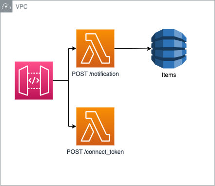

# Implementation of all resources in AWS

The project is built on top of [Serverless Framework](https://serverless.com/framework/) and [Pluggy](https://pluggy.ai).

This project is a 2 minute setup to quickly start using Pluggy on your AWS environment.

## Quick start

### Prerequisites

Before you can deploy this project's infrastructure you will need to setup an AWS account on your environment.
For more information on how to configure you IAM Credentials visit [SST IAM Setup](https://docs.serverless-stack.com/advanced/iam-credentials).

### Running the example

```bash
npm install
npm start
```

### Configuration

Setup your `.env` with your AWS credentials & your Pluggy Client ID and Secret, before running `npm start` or `npm deploy`.

With the created resources you can already start using Pluggy's widget on your website.

## Architecture

In the following image the high-level architecture of the project is shown.




The following resources are implemented:
- DynamoDB: [DynamoDB](https://docs.serverless-stack.com/packages/dynamodb)
Stores the items created on Pluggy to recover by it's id.
- Labda: [Lambda](https://docs.serverless-stack.com/packages/lambda)
  - Notification: Process webhooks from Pluggy [Pluggy](https://docs.pluggy.ai/webhooks)
  - Connect Token: Recovers a connect token to inializate a Widget instance.

## Commands

### `npm run start`

Starts the local Lambda development environment.

### `npm run build`

Build your app and synthesize your stacks.

Generates a `.build/` directory with the compiled files and a `.build/cdk.out/` directory with the synthesized CloudFormation stacks.

### `npm run deploy [stack]`

Deploy all your stacks to AWS. Or optionally deploy a specific stack.

### `npm run remove [stack]`

Remove all your stacks and all of their resources from AWS. Or optionally remove a specific stack.

### `npm run test`

Runs your tests using Jest. Takes all the [Jest CLI options](https://jestjs.io/docs/en/cli).

## Documentation

- [Pluggy Docs](https://docs.pluggy.ai)
- [Serverless Stack Docs](https://docs.serverless-stack.com)
