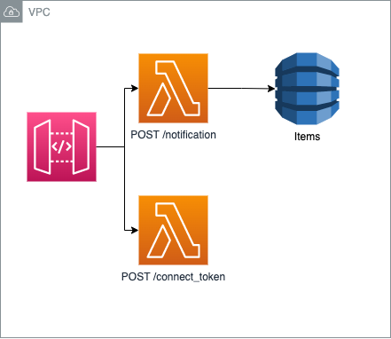

# Pluggy - AWS Serverless (SST) Example

AWS serverless infrastructure for Pluggy integration using Lambda, DynamoDB, and the [Serverless Stack (SST)](https://sst.dev/) framework.

> **Note**: This example uses SST v1 (`@serverless-stack/*`), which is deprecated. For new projects, consider using [SST v3](https://sst.dev/) or the [Vercel quickdeploy](../vercel-quickdeploy-nextjs) example.

## Prerequisites

- Node.js 18+
- AWS account with configured credentials ([IAM setup guide](https://docs.sst.dev/advanced/iam-credentials))
- Pluggy API credentials from [dashboard.pluggy.ai](https://dashboard.pluggy.ai)

## Setup

1. Create a `.env` file with:

- AWS credentials
- `PLUGGY_CLIENT_ID`
- `PLUGGY_CLIENT_SECRET`

2. Install and run:

```bash
npm install
npm start
```

## Architecture



| Resource | Purpose |
|----------|---------|
| **DynamoDB** | Stores items created via Pluggy |
| **Lambda (Notification)** | Processes Pluggy webhook events |
| **Lambda (Connect Token)** | Generates connect tokens for the widget |

## Commands

| Command | Description |
|---------|-------------|
| `npm start` | Start local Lambda dev environment |
| `npm run build` | Build and synthesize CloudFormation stacks |
| `npm run deploy` | Deploy to AWS |
| `npm run remove` | Remove all stacks from AWS |
| `npm test` | Run tests |

## Resources

- [Pluggy Documentation](https://docs.pluggy.ai)
- [Pluggy Webhooks](https://docs.pluggy.ai/#webhooks)
- [SST Documentation](https://docs.sst.dev)
